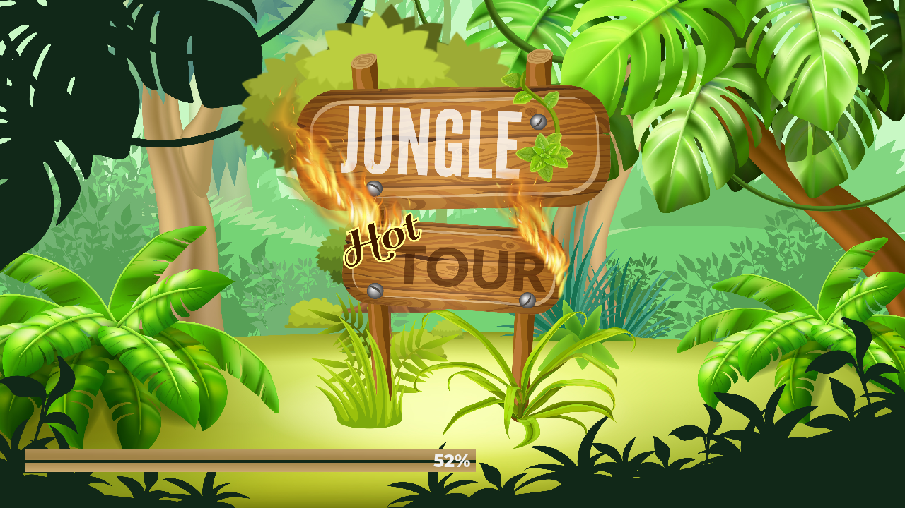
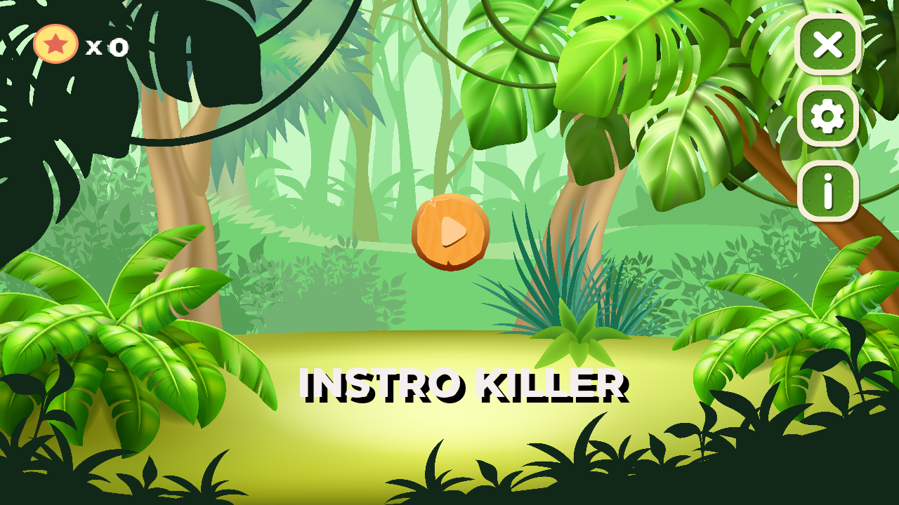
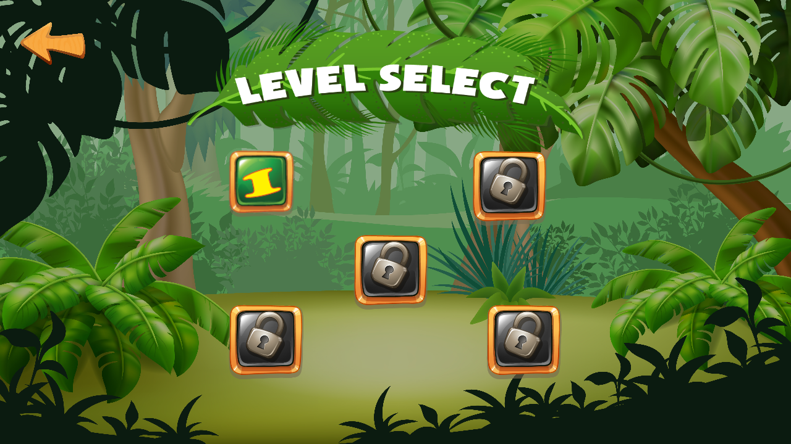
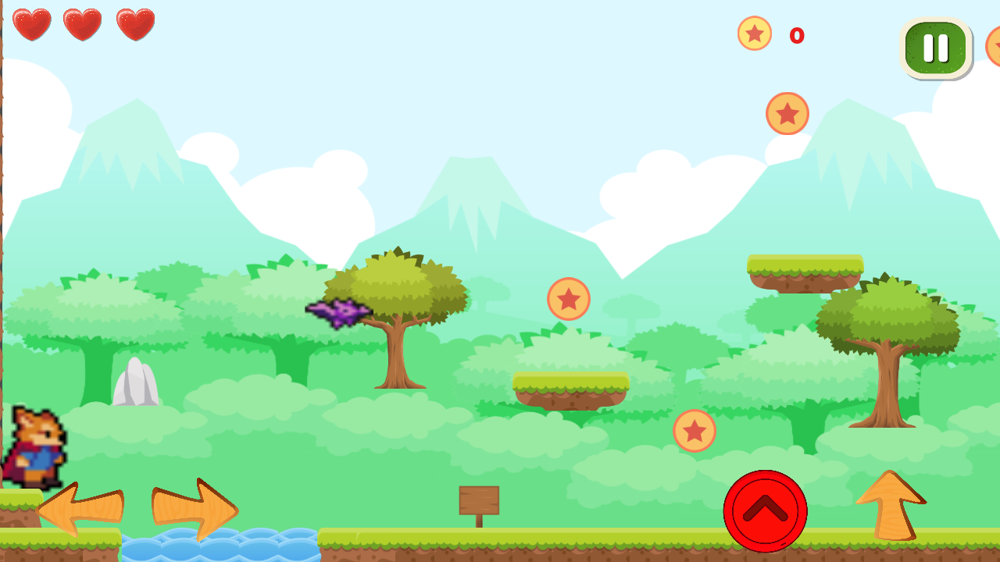
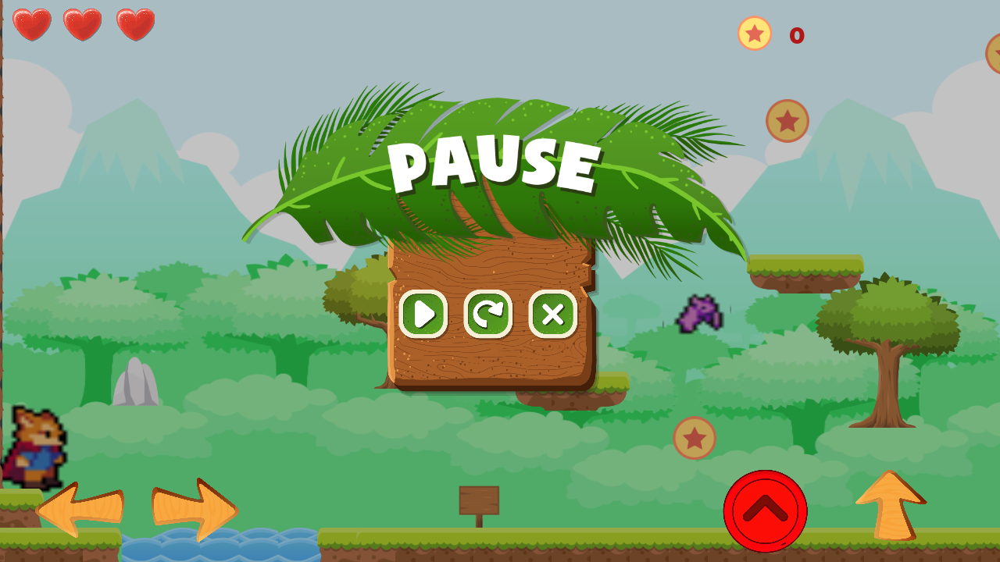

# 2D-GAME-GODOT

**This is a game based on 2 Dimensional This game is properly made for android device 
In this game we have the actor or player who plays the game  
In this game in we have the levels we have to complete the levels In this there are lots of  difficulties  which player has to pass and the end the level** 

## Advantages:

In this game we are adding the new coins which player has to get with the help coins the power will depend
We have the different energies which we have to get 
New carrier are added with help of that carrier player can fast his journey through the levels

## Disadvantage:
This is an 2d games so we do not have the graphics like a 4d games
Runners have the limitation of level

	FEASIBILITY STUDY
The feasibility analysis. This section verified that it is feasible  to add game on the Android System from the aspects of Technical, Economical, Organizational and Cultural feasibility. 
Technical Feasibility :- 
• The project is feasible within the limits of current  technology.  
• Not required any extra programmers to create such 2d game 
• Can run with lower version of software and  hardware. 
 • can modified in engine
Economical Feasibility :- 
• System is cost effective .  
• There is no estimate cost of user end hardware , this  game can be played on any device that supports  android.  
• There is no loss of the developer but can be  
profitable to developer if got sponsors.  
     • No cost for software development just require some  time and    knowledge. 

Organizational Feasibility :-  
• The main aim is to setup a globally accessible  application that can be used by any user having  android devices. 
• The technical tools and software’s that are used are  freely and easily available and can easily be used. • To create this project, I have explored Android Studio  little more rand learned some new things which I  didn’t learnt earlier. 
• The methods, creativity and imagination etc. all these  helps the organizations to develop the better and  successful software. 
Cultural Feasibility :- 
• As now internet almost reaches every corner of the  world which will allow almost every user of any age  having access to this application. 
• User can download and play the game offline 
• There is zero profit margin with this application as it  is free for users to download. 

✓ Software Requirements :- 
  ➢ Operating System :- 
  ❖ Windows 7 (minimum). 

  ❖ Windows 8. 
  ❖ Windows 10 (recommended). 
➢ Tools & Software :- 
  ❖ GODOT ENGINE

✓ Hardware Requirements :- 
  ➢ Disk Space :- Minimum 10 GB or more. 
  ➢ Processor :-  
    ❖ Windows 7 (Minimum). 
    ❖ Windows 10(Recommended). 
  ➢ Memory :- 
    ❖ 4GB (minimum) 
    ❖ 8GB (recommended) 
    ❖ 12GB and more for Best Experience.
    
 

